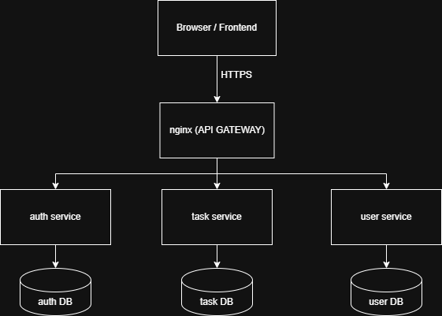
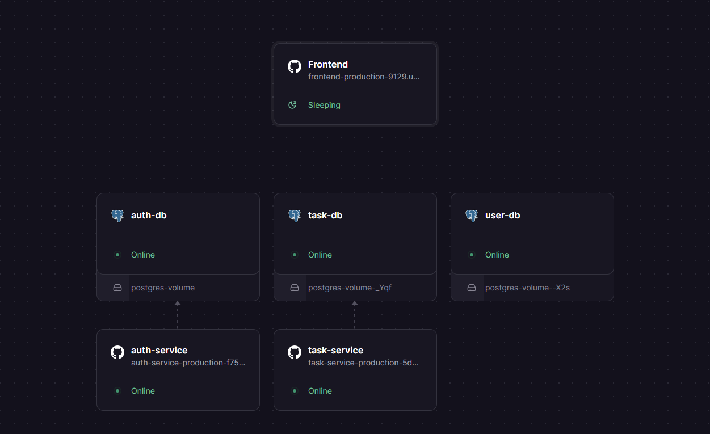
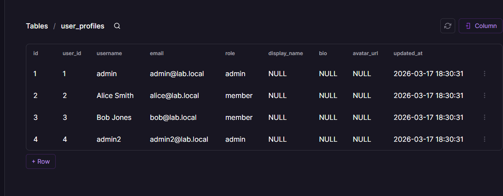
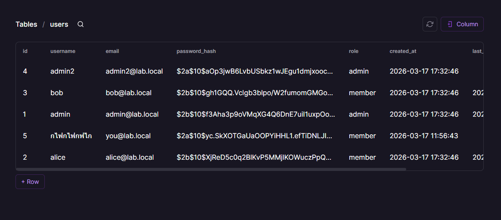
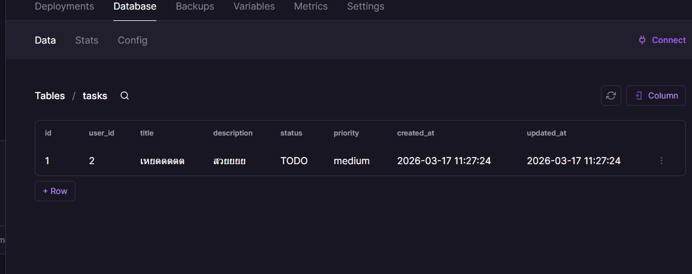

# ENGSE207 Final Lab – Set 2

---

## 👨‍🎓 Student Information

| Name | Student ID |
|------|-----------|
| เจษฎา อินตา |ุ 675432310006-2 |
| จักรภัทร พรมทา | 67543210013-8 |

---

## 🌐 Deployed Services (Railway)

| Service | URL |
|--------|-----|
| Frontend | https://frontend-production-9129.up.railway.app/index.html |
| Auth Service | https://auth-service-production-f754.up.railway.app/api/auth/health |
| User Service | https://task-service-production-5d53.up.railway.app/api/tasks/health |
| Task Service | https://user-service-production-5a00.up.railway.app/api/users/health |

---

## 🔄 How Set 2 Extends Set 1

Set 2 เป็นการพัฒนาต่อยอดจาก Set 1 โดยมีการเปลี่ยนแปลงสำคัญดังนี้:

- เปลี่ยนจาก Monolithic เป็น Microservices Architecture
- แยก service ออกเป็น 3 ส่วน:
  - Auth Service (จัดการ authentication)
  - User Service (จัดการข้อมูลผู้ใช้)
  - Task Service (จัดการงาน)
- จากเดิมใช้ database เดียว → แยกเป็น 3 databases
- เพิ่ม API Gateway (Nginx) เพื่อเป็นตัวกลางในการ routing request
- ใช้ JWT ในการยืนยันตัวตนระหว่าง services
- รองรับการ deploy บน Cloud (Railway)

---

## 🏗️ Architecture Diagram (Cloud)

```text
Browser / Frontend
        │
        │ HTTPS
        ▼
   Nginx (API Gateway)
        │
 ┌──────┼──────────────┐
 │      │              │
 ▼      ▼              ▼
Auth   User         Task
Service Service     Service
 │       │            │
 ▼       ▼            ▼
Auth DB User DB     Task DB

```

🚪 Gateway Strategy
Strategy: Reverse Proxy (Nginx)
ระบบใช้ Nginx เป็น API Gateway เพื่อทำหน้าที่เป็น Reverse Proxy
Routing Strategy:

/api/auth/* → Auth Service

/api/users/* → User Service

/api/tasks/* → Task Service

เหตุผลที่เลือก:
รวม endpoint ไว้ที่จุดเดียว
ลดความซับซ้อนของ frontend
ซ่อน internal service structure
เพิ่มความยืดหยุ่นในการ scale และ deploy

🐳 Run Locally with Docker Compose
คำสั่งรัน:
docker-compose up --build
Services ที่รัน:
nginx (API Gateway)
auth-service
user-service
task-service

postgres (แยก DB ต่อ service)

⚙️ Environment Variables
```
🔐 Auth Service
DATABASE_URL=${{auth-db.DATABASE_URL}}
JWT_SECRET=dev-shared-secret
JWT_EXPIRES_IN=1h
PORT=3001
NODE_ENV=production
```
```
👤 User Service
DATABASE_URL=${{task-db.DATABASE_URL}}
JWT_SECRET=dev-shared-secret
PORT=3002
NODE_ENV=production
```
```
📋 Task Service
DATABASE_URL=${{user-db.DATABASE_URL}}
JWT_SECRET=dev-shared-secret
PORT=3003
NODE_ENV=production
```

🧪 Testing with curl (Cloud URLs)
🔐 Login
```
TOKEN=$(curl -s -X POST https://auth-service-production-f754.up.railway.app/api/auth/login \
  -H "Content-Type: application/json" \
  -d '{
    "email":"testuser@example.com",
    "password":"123456"
  }' | jq -r '.token')

```
👤 Get Profile
```
curl https://auth-service-production-f754.up.railway.app/api/auth/me \
  -H "Authorization: Bearer $TOKEN"

```
📋 Get Tasks
```
curl https://task-service-production-5d53.up.railway.app/api/tasks \
  -H "Authorization: Bearer $TOKEN"

```
➕ Create Task
```
curl -X POST https://task-service-production-5d53.up.railway.app/api/tasks \
  -H "Authorization: Bearer $TOKEN" \
  -H "Content-Type: application/json" \
  -d '{
    "title":"My first cloud task",
    "description":"Deploy all services to Railway",
    "status":"TODO",
    "priority":"high"
  }'

```

⚠️ Known Limitations
ไม่มี Foreign Key ข้าม database
Referential integrity ต้องจัดการในระดับ application
ใช้ user_id เป็น logical reference แทน FK
ไม่มี distributed transaction
หาก service ใดล่ม อาจส่งผลต่อระบบโดยรวม
ยังไม่มีระบบ retry หรือ circuit breaker

📸 Screenshots
1. Architecture Diagram



2. Railway Deployment



3. API Testing

อยู่ใน floder screenshot ทั้งหมด

4. Database Tables

ีuser DB



auth DB



task DB

